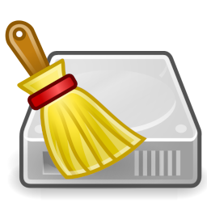

CleanerML Repository
====================

CleanerML
---------
CleanerML is a simple yet powerful markup language for writing cleaners. Most of BleachBit's cleaners are written in CleanerML, and you can write your own cleaners in CleanerML, too.

You can think of it as writing XML to delete files, but it is more powerful than that.

BleachBit
---------
BleachBit is an open source system cleaner for Windows and Linux.

How to contribute
-----------------

There are three ways to contribute: review a pull request, review cleaners that
are already submitted, or write your own cleaner.

For any of these, start here:
1.  Download [BleachBit](https://www.bleachbit.org).
2.  Read [Documentation on CleanerML](http://docs.bleachbit.org/doc/cleanerml.html).
3.  Read [Contributing a cleaner](https://docs.bleachbit.org/cml/contributing.html).

After making changes to a cleaner, run `make tests` to check for errors because the
XSD can find many errors in the XML. It's best to also run `make pretty` before
commiting a change.

How to use
----------
In the future automated sync may be as easy as checking one option, but for now you must manually
download and copy the files to your personal cleaners directory.  The easiest way to find the
directory is to open BleachBit, on Linux click the hamburger menu (three horizontal lines), click Diagnostics (or on Windows  click the  menu button, click `System Information`),
and look for the line with `personal_cleaners_dir`.

Contents
--------
The directory `pending` contains cleaners that are waiting for someone to verify they are safe and effective.
The directory `release` contains cleaners that are considered safe and effective.

Additional information
--------
Your cleaners should retain the copyright and information header found in `release/*.xml`. Please edit the copyright information accordingly. If needed, you can also include extra maintenance information in the header, as found in [release/openshot.xml](https://github.com/bleachbit/cleanerml/blob/master/release/openshot.xml):

    @url http://full.url.of/software-project
    @tested ok softwareversion, OSnameandversion
    @note Some notes for cleaner maintainers

License
-------
The contents of this repository are licensed under the 
[GNU General Public License](https://www.gnu.org/copyleft/gpl.html)
version 3 or later.  Do not submit work for which you do not own the copyright or
which cannot be licensed under the GNU GPL v3+.
